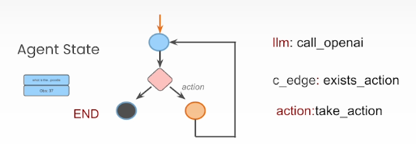

-
-
- ## Keywords
	- cyclic graphs
	- persistance
	- human-in-the-loop
- Components
	- Nodes: agents or function
	- edges: connect nodes
	- Conditional edges: decisions
- Concepts
	- Data/state: be tracked over time
		- Agent state is **accessible** to all parts of the graph
		- Be **local** to the graph
		- Can be stored in a persistence layer: can **resume** that state anytime
- ## Reviews
	- 
	- An AI agent can be represented as a graph. The core component of LangChain for this task is **GraphState**. When user sends messages, the messages are **forwarded to LLM**. LLM might need helps to look up something. LLM returns query to Graph, graph, if condition edge passes, route the query to **tool** by **take_action**