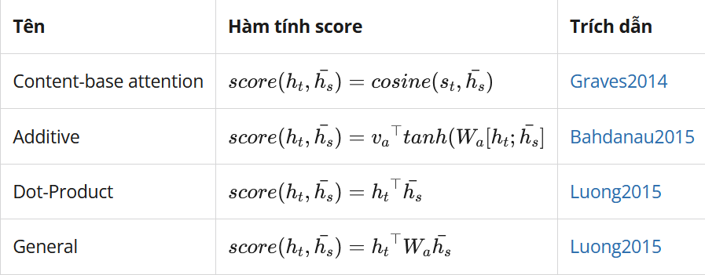

- Research
	- Keywords
		-
	- Intro
		- Types
			- self-attention
			- additive attention
			- dot-product attention/scaled dot-product attention
				- Query (Q): **watching word** in sentence
				- Key (K): represents **remain words**
				- Value (V): similarity score of **each word** in sentence with the **watching word**
			- bi-directional attention: BERT
			- multi-head attention
				- **each head** focus on **part of sentence**. e.g: subject, verb, object...
			- {:height 152, :width 477}
	- Contributions
		- Scaled dot-product attention
		- Experiments
			- Metrics
				- BLEU
				-
	- Related works
	- Vocab
	- Conclusions
		- Positional encoding
		- Resolve RNN's bottleneck of context vector (transition from encoder to decoder)