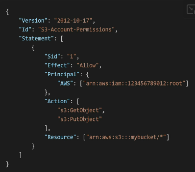

- > JSON specified permissions demonstrate which services **a user, group, role** can't do in AWS
- 
- policies structure
	- Statement
		- effect: allow, deny
		- principle: account/user/role to which is applied to
		- action:
		- [condition]
- Policies can be add to a group or an user directly
- Policies can be created in the form of its structure above