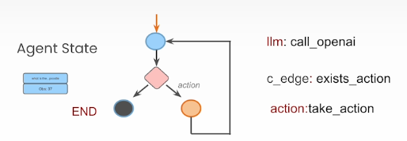
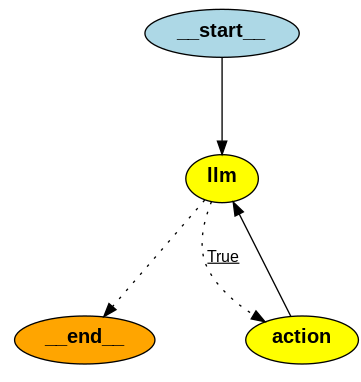

## Keywords
	- cyclic graphs
	- persistent
	- human-in-the-loop
- ## Components
  collapsed:: true
	- **Nodes**: agent, LLM call, tool, decision making (if-else)
	- **edges**: connect nodes
		- Conditional edges: decisions
	- **State**:
		- be passed between nodes during execution
- ## Concepts
	- Data/state: be tracked over time
	  collapsed:: true
		- Agent state is **accessible** to all parts of the graph
		- Be **local** to the graph
		- Can be stored in a persistence layer: can **resume/update** that state anytime
	- **Cognitive architecture**
	- ### Multi-agent System
		- Hand-off
			- agent as node **handoff** forward **payload** -> **destination**
			- Handoff within current graph | handoff to **agent of other graph**
				- ```python
				  def some_node_inside_alice(state):
				      return Command(
				          goto="bob",
				          update={"my_state_key": "my_state_value"},
				          # specify which graph to navigate to (defaults to the current graph)
				          graph=Command.PARENT,
				      )
				  ```
- ## Reviews
  collapsed:: true
	- 
	- An AI agent can be represented as a graph. The core component of LangChain for this task is **GraphState**. When user sends messages, the messages are **forwarded to LLM**. LLM might need helps to look up something. LLM returns query to Graph, graph, if condition edge passes, route the query to **tool** by **take_action**
	- e.g: Agentic search tools
	  collapsed:: true
		- Init an agent consisting a graph of nodes which are **LLM and action**. LLM can make **decision to call the initiated tool or not.** Note that the tools are agent's attributes, LLM only **control the tool invocation**. In the action node, based on the decision of the LLM node, the graph invoke the tool then return the control back to LLM
		- 
- ## Miscs
- ## Practices
	- ### Sub-graph
		- **state** transfer between parent graph and sub graph
			- share **state's key** -> include **subgraph as a node** in parent graph
			- **different schema** -> **call sub graph from inside a node** in the parent
		- Checkpoint
			- If you want the subgraph to **have its own memory**, you can compile it `with checkpointer=True`
				- ```python
				  subgraph_builder = StateGraph(...)
				  subgraph = subgraph_builder.compile(checkpointer=True)
				  ```
	-
- [[human-in-the-loop]]
  collapsed:: true
	- https://langchain-ai.github.io/langgraph/concepts/human_in_the_loop
	- `human node` can return message to next node/ return Command for routing
	- Approve or Reject
		- > Depending on the human's approval or rejection, the graph can **proceed with the action** or **take an alternative path**.
		- ```python
		  def human_approval(state: State) -> Command[Literal["some_node", "another_node"]]:
		    if is_approved:
		      return Command(goto="some_node")
		    else:
		      return Command(goto="another_node")
		  ```
	- Review & Edit State
	  collapsed:: true
		- ```python
		  def human_editing(state: State):
		      ...
		      result = interrupt(
		          # Interrupt information to surface to the client.
		          # Can be any JSON serializable value.
		          {
		              "task": "Review the output from the LLM and make any necessary edits.",
		              "llm_generated_summary": state["llm_generated_summary"]
		          }
		      )
		  
		      # Update the state with the edited text
		      return {
		          "llm_generated_summary": result["edited_text"] 
		      }
		  ```
	- Review Tool Calls
		- >A human can review and edit the output from the LLM
		- routing can be done as in previous examples
	- Multi-turn conversation
		- > A **multi-turn conversation architecture** where an **agent and human node** cycle back and forth until the agent decides to hand off the conversation to another agent or another part of the system. **One or more agents** may need to carry out multi-turn conversations with a human
- ## When to use
  collapsed:: true
	- **Multi-step reasoning processes** that need explicit control on the flow
	- **Applications requiring persistence of state** between steps
	- **Systems that combine deterministic logic with AI capabilities**
	- **Workflows that need human-in-the-loop interventions**
	- **Complex agent architectures** with multiple components working together
-