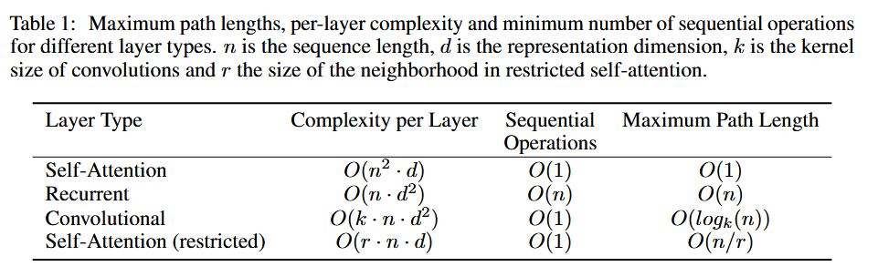

## Architecture
	- Input Embedding of **tokens**
	- Positional Encoding
	- N x Encoder Layer (N=6)
		- > residual of input features
		- Multi-head attention
			- n head (n=3), each head is an self-attention
			- attention:
				- deck:: transformer
				- first input feature is a sequence of **token embedding**
				- each token embedding is then multiplied with $$\mathbf{W}_Q, \mathbf{W}_K, \mathbf{W}_V$$ to form matix $$Q, K, V$$
				- then apply matrix multiplication on $$Q, K$$, divide it by square of $$d_k$$ (size of $$K$$) then multiply with $$V$$
				- attention score: #card
				  id:: 67da2e75-e45c-4082-ade5-50ac5487d006
					- $$Attention(Q,K,V) = softmax(\frac{Q, K^T}{\sqrt{d_K}}) V$$
					- Note that $$Q, K$$ vectors are independent vectors so each components of a vector has mean 0 and variance 1 -> dot product of $$Q_i, K_i$$ (shape $$d_K$$ as embedding size) is a scalar having mean 0 and variance $$d_k$$
					- When $$d_k$$ is large dot product of $$Q_i, K_i$$ is linearly high. These are passed to softmax function. If one exponential component is much large than the rest, this results in the attention weight of that component is pushed to 1 and others to 0
			- Q, K, V come from **the output of previous layer**
		- Feed forward Network
	- N x Decoder Layer
		- deck:: transformer
		- in each decoder layer #card
		  id:: 67da2e75-4bb0-42ad-8c64-368ad1b5252c
			- the Q comes from **previous decoder layer**
			- K and V come **from output of encoder**
			- **Attention mask** is applied to disable attention on **future tokens** in auto regressive task
				- A mask of size $$n\times n$$ (n is the length of sequence) has upper triangle set to $$-\infty$$ -> current state **only attends to current and previous ones** ($$e^{-\infty}=0$$)
	- Language Model Head ()
- ## Q&A
	- deck:: transformer
	- how transformer handles long sequence #card
	  id:: 67da2e75-db61-4073-a96e-d24a75b42c67
		- **Truncation**: Simply cutting off the input at the maximum length, though this may lead to loss of important information.
		- **Sliding Window**: Processing overlapping segments of the input and combining the outputs, which increases computational load but preserves context.
		- **Hierarchical Models**: First processing smaller chunks to obtain representations, then combining these to capture long-range dependencies.
		- **Efficient Transformer Architectures**: Developing models that reduce computational complexity, such as:
			- **Mamba**: Integrates Structured State Space Models (S4) to handle long sequences efficiently.
			- **Reformer**: Utilizes locality-sensitive hashing and reversible layers to reduce complexity from O(n²) to O(n log n).
			- **Sparse Transformers**: Employs sparse attention mechanisms to focus on relevant parts of the input, reducing unnecessary computations.
	- why self-attention #card
	  id:: 67da2e75-59bc-4860-8b76-60d6b4182470
		- 
		- high **complexity per layer** but **Sequential operations** as well as **maximum path length** is low
	- Problems of transformer
		- self-attention has $$\mathbf{O(n^2)}$$ complexity #card
		  id:: 67da2e75-af02-4bae-8ee5-383331bf41bc
			- [[BERT]] : Uses masked token prediction
			- [[GPT]] : Uses autoregressive decoding to
			  reduce cost
		- Autoregressive models **process text one way**, missing full context #card
		  id:: 67da2e75-4446-4d94-8d23-d9f79989de8c
			- [[BERT]] : Uses **bidirectional attention**
			- T5: Uses encoder-decoder for deeper
			  context
		- Transformers need **huge labeled datasets** to train effectively.
			- [[BERT]]: **Uses Masked Language Modeling** (MLM)
			- BART: **Uses denoising autoencoding**
-